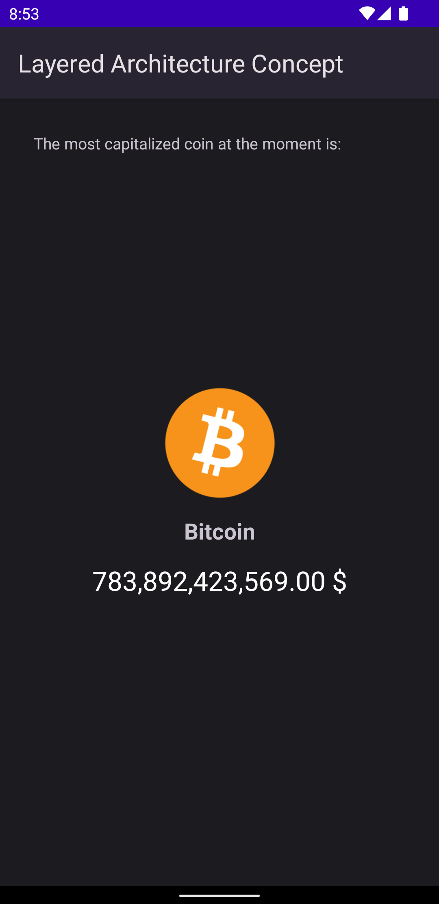

# Android Multimodule Architecture Concepts

_Android Multimodule Architecture Concepts_ is a project to showcase different architectural approaches to developing multi-modular Android apps.

The architecture proposed consists of 3 different layers:
* **Presentation layer**: contains all the Android UI framework components (e.g. Activities, Fragments, ViewModels...) and the related resources (e.g. images, strings...).
* **Domain layer**: contains the platform-independent business logic and models.
* **Data layer**: contains the repositories, the data sources api implementations and the corresponding api-specific models.

These layers are implemented using 3 separate modules to increase decoupling and separation of concerns. The dependencies between the modules are set so that the _data layer_ is completely invisible to the _presentation layer_ and vice versa.

## Architecture concepts 

The project hosts each architecture concept in a separate branch (the _main_ branch only contains an empty template for all the concepts). 

The proposed concepts are:
* [**Layered Architecture Concept**](https://github.com/davide-pani/android-multimodule-architecture-concepts/tree/layered-architecture-concept): the dependency between the modules is <code>_presentation_ -> _domain_ -> _data_</code>. The 3 modules are Android modules.
* [**Clean Architecture Concept**](https://github.com/davide-pani/android-multimodule-architecture-concepts/tree/clean-architecture-concept): the dependency between the modules is <code>_presentation_ -> _domain_ <- _data_</code>. The _presentation_ and _data_ modules are Android modules whereas the _domain_ module is a Kotlin library being the innermost platform-independent module.
  
## Screenshots
  
The App just shows the most capitalized cryptocurrency in the current moment (which of course is Bitcoin 😄).
  

